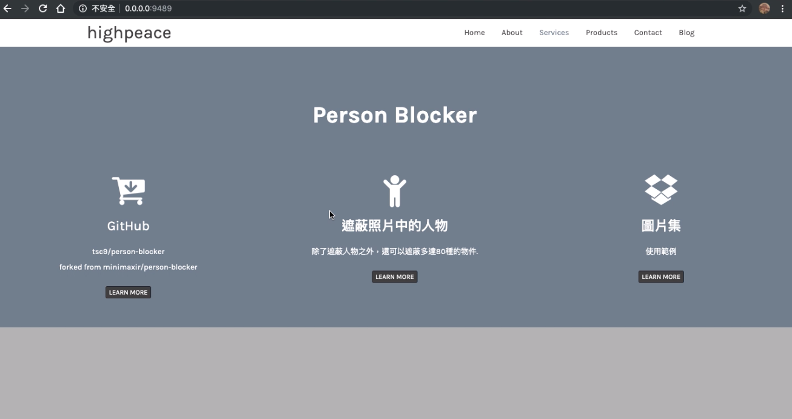
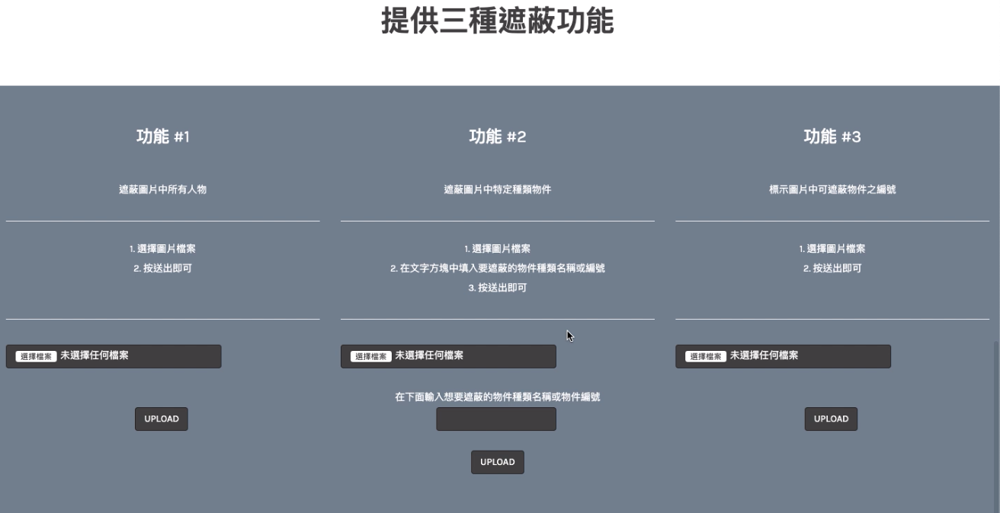
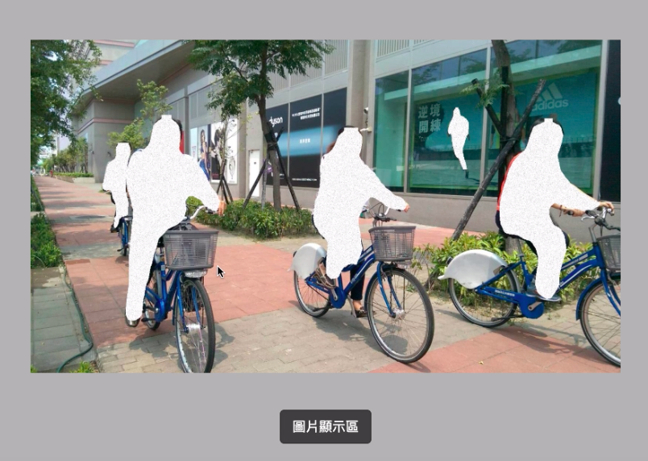
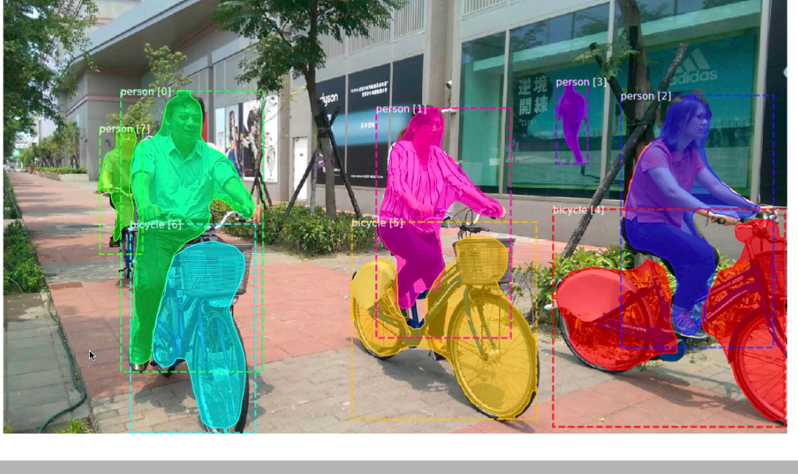
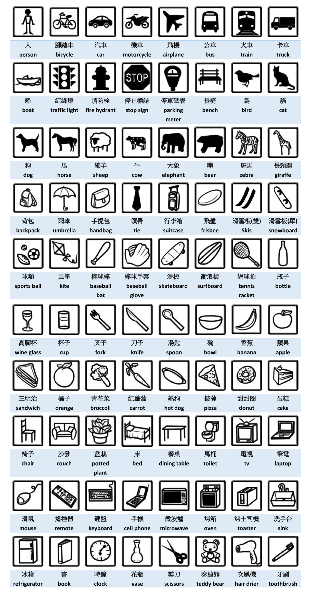

# Person Blocker
國立臺北大學 軟體工程專案
Youtube Demo 影片（裡面有使用方法）:
https://youtu.be/jeU8TdQukQk

改進構想：
使用 Python 的 Flask 做一個 Web Service：
提供
1.  上傳圖片功能
2.  設定功能（設定需要遮蔽的東西)
3.  顯示屏蔽之後的圖片 (讓使用者可以下載)
優點：可以讓更多使用者透過網頁來使用這些功能，使用者不需要先去安裝很多東西








除了遮蔽人物，可遮蔽物件種類如下：

=====================================================

=====================================================


A script to automatically "block" people in images (like the [Black Mirror](https://en.wikipedia.org/wiki/Black_Mirror) episode [White Christmas](https://en.wikipedia.org/wiki/White_Christmas_(Black_Mirror))) using [Mask R-CNN](https://github.com/matterport/Mask_RCNN) pretrained on the [MS COCO](https://arxiv.org/abs/1405.0312) dataset. No GPU required!

But you can block more than just people: up to [80 different types](https://github.com/minimaxir/person-blocker/blob/master/classes.py) of objects can be blocked, including giraffes and busses!

## Setup

This project relies on a handful of dependencies, use the following command to install your dependencies:

```shell
pip3 install -r requirements.txt
```

_Note_: Depending on your environment, you may need to use `sudo`. You may also want to use virtualenv.

## Usage

Person Blocker is used from the command line:

```shell
python3 person_blocker.py -i images/img3.jpg -c '(128, 128, 128)' -o 'bus' 'truck'
```

* `-i/--image`: specifies the image file.
* `-m/--model`: path to the pretrained COCO model weights (default: current directory): if not specified, it will download them automatically to the current directory if not already present (note: the weights are 258 MB!)
* `-c/--color`: color of the mask, in either quote-wrapped hexidecimal or 3-element RGB tuple format. (default: white)
* `-o/--object`: list of types of objects to block (or object IDs of specific objects). You can see the allowable choices of objects to block in `classes.py` or by using the `-names` flag. (default: person)
* `-l/--labeled`: saves a labeled image annotated with detected objects and their object ID.
* `-n/--names`: prints the class options for objects, then exits.

The script outputs two images: a static (pun intended) image `person_blocked.png` and an animated image `person_blocked.gif` like the one at the beginning of this README.

## Examples

```shell
python3 person_blocker.py -i images/img1.jpg
```


```shell
python3 person_blocker.py -i images/img2.jpg -c '#c0392b' -o 'giraffe'
```


```shell
python3 person_blocker.py -i images/img3.jpg -c '(128, 128, 128)' -o 'bus' 'truck'
```


Blocking specific object(s) requires 2 steps: running in inference mode to get the object IDs for each object, and then blocking those object IDs.

```shell
python3 person_blocker.py -i images/img4.jpg -l
```


```shell
python3 person_blocker.py -i images/img4.jpg -o 1
```


## Requirements

The same requirements as Mask R-CNN:
* Python 3.4+
* TensorFlow 1.3+
* Keras 2.0.8+
* Numpy, skimage, scipy, Pillow, cython, h5py

plus matplotlib and imageio

## Maintainer

Max Woolf ([@minimaxir](http://minimaxir.com))

*Max's open-source projects are supported by his [Patreon](https://www.patreon.com/minimaxir). If you found this project helpful, any monetary contributions to the Patreon are appreciated and will be put to good creative use.*

## License

MIT

Code used from Mask R-CNN by Matterport, Inc. (MIT-Licensed), with minor alterations and copyright notices retained.
